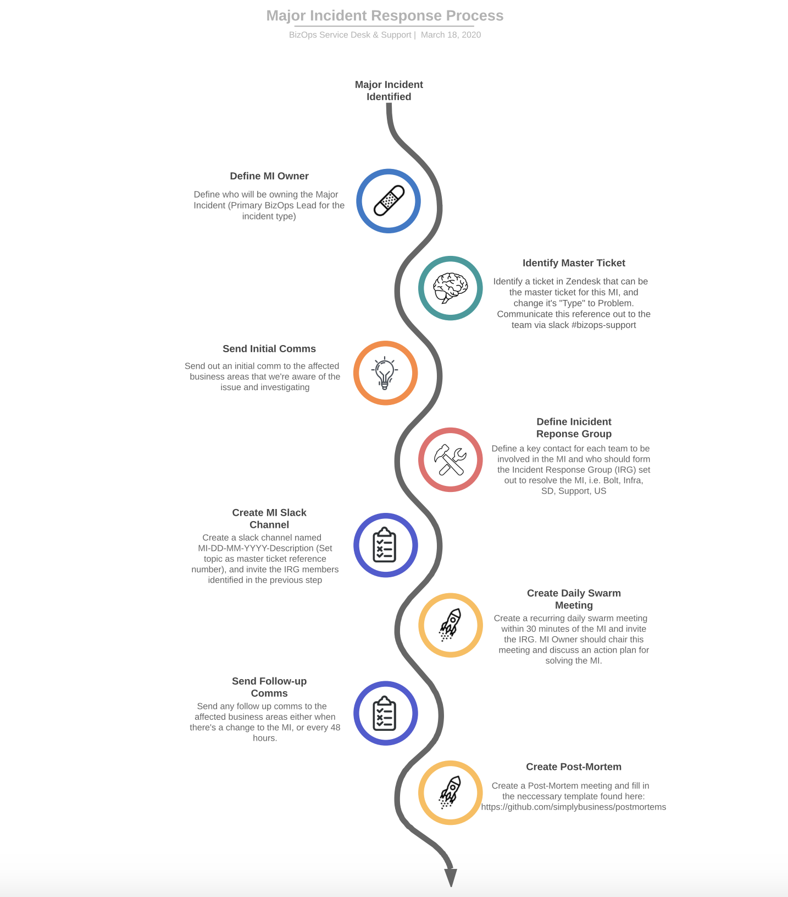

# Introduction
The Service Desk is the first point of contact for technical issues faced by internal employees. When a possible Major Incident has been identified, a Major Incident Lead needs to be designated (BizOps Service Desk Lead is the primary Incident Lead for the UK, followed by the BizOps Support Lead, BizOps US Lead for US exclusive MI's).

It's the Major Incident Leads responsibility to send out to the relevant business areas during a Major Incident. A template of these comms is below: 

**Application - Problem description**

**Issue:**
Description of the issue
 
**Impact:**
What areas of the business are affected and what is the impact of this service being unavailable or limited
 
**Actions:**
Next step actions 
 Please communicate this comms out to:

Slack Channel

- 

- 

- 

# Process

# Scenarios
Below are some of scenarios of incidents that would be considered Major Incidents:

Idiophone freezing for multiple users

Unable to log into Chromebooks (All users)

Unable to log into Windows laptops (All users)

Down-Meeting room equipment- Zoom (All rooms)

Unable to log into Adrenaline (wifi) (All users)

Unable to log into VPN (All users)

All printers down

Google Down /Inaccessible

JumpCloud Down /Inaccessible

Slack Inaccessible

For test purposes

